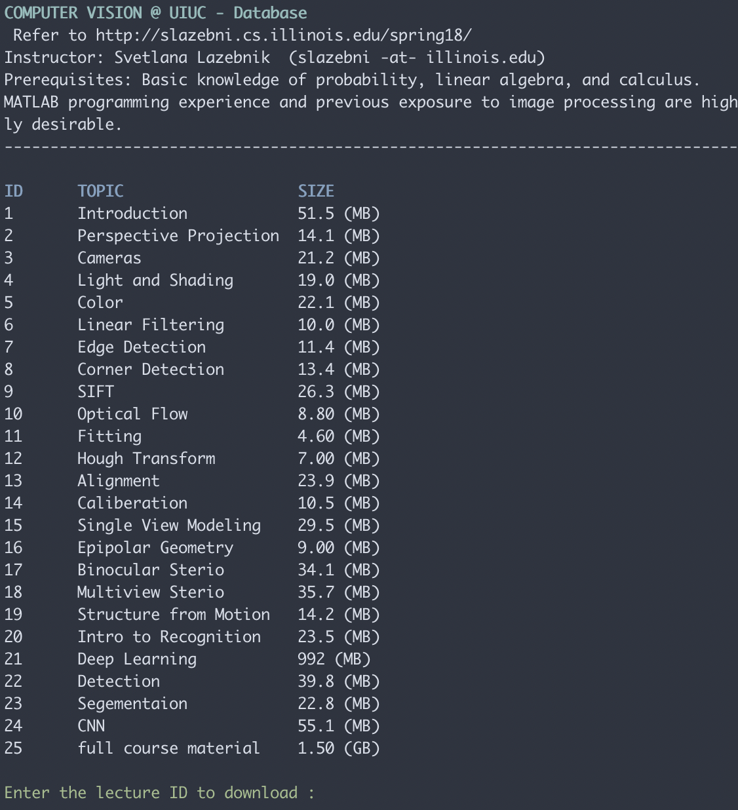
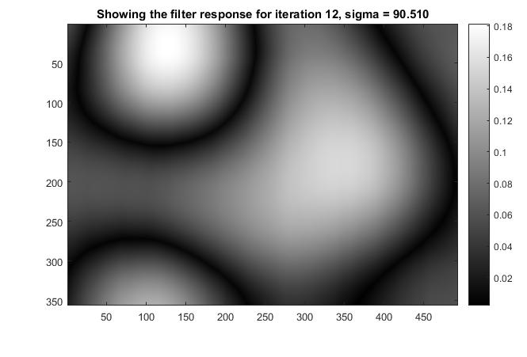

# Computer Vision @ UIUC
[](http://hits.dwyl.io/namanUIUC/https://githubcom/namanUIUC/ComputerVision)

This project contains detailed computer vision techiniques. The lecture slides and assignments are from [CS543 UIUC Spring 2018](http://slazebni.cs.illinois.edu/spring18/).

**Instructor: Svetlana Lazebnik**  (slazebni -at- illinois.edu)

<p align="center">
  
</p>

## Overview

In the simplest terms, computer vision is the discipline of `teaching machines how to see`. This field dates back more than fifty years, but the recent explosive growth of digital imaging and machine learning technologies makes the problems of automated image interpretation more exciting and relevant than ever. There are two major themes in the computer vision literature: 3D geometry and recognition. The first theme is about using vision as a source of **metric 3D information**: given one or more images of a scene taken by a camera with known or unknown parameters, how can we go from 2D to 3D, and how much can we tell about the 3D structure of the environment pictured in those images? The second theme, by contrast, is all about vision as a source of **semantic information**: can we recognize the objects, people, or activities pictured in the images, and understand the structure and relationships of different scene components just as a human would? This course will provide a coherent perspective on the different aspects of computer vision, and give students the ability to understand state-of-the-art vision literature and implement components that are fundamental to many modern vision systems.

### Prerequisites

Basic knowledge of probability, linear algebra, and calculus. MATLAB programming experience and previous exposure to image processing are highly desirable. 


## Syllabus

1. **Image formation and low-level vision**
   1. Camera models
   2. Light and color
   3. Linear filters and edges
   4. Feature extraction
   5. Optical flow and feature tracking
2. **Grouping and fitting**
   1. Hough transform
   2. RANSAC
   3. Alignment, image stitching
3. **Geometric vision**
   1. Camera calibration
   2. Epipolar geometry
   3. Two-view and multi-view stereo
   4. Structure from motion
4. **Recognition and beyond**
   1. Statistical learning framework
   2. Image classification
   3. Deep convolutional neural networks
   4. Object detection
   5. Segmentation

## Course Content - DB

I have create a database to download the lecture materials from the course. To download the material:

```
git clone https://github.com/namanUIUC/ComputerVision.git
cd ComputerVision
bash course_material_DB.sh
```

Demo:

<p align="center">
  
</p>

## Machine Problems

### [Colorizing Prokudin-Gorskii images of the Russian Empire](src/1-Colorizing_Prokudin-Gorskii_images_of_the_Russian_Empire)

#### Background

[Sergei Mikhailovich Prokudin-Gorskii](http://en.wikipedia.org/wiki/Prokudin-Gorskii) (1863-1944) was a photographer who, between the years 1909-1915, traveled the Russian empire and took thousands of photos of everything he saw. He used an early color technology that involved recording three exposures of every scene onto a glass plate using a red, green, and blue filter. Back then, there was no way to print such photos, and they had to be displayed using a special projector. Prokudin-Gorskii left Russia in 1918. His glass plate negatives survived and were purchased by the Library of Congress in 1948. Today, a digitized version of the Prokudin-Gorskii collection is [available online](http://www.loc.gov/exhibits/empire/gorskii.html).

<p align="center">
  
</p>


#### Overview

The goal of this assignment is to learn to work with images by taking the digitized Prokudin-Gorskii glass plate images and automatically producing a color image with as few visual artifacts as possible. In order to do this, you will need to extract the three color channel images, place them on top of each other, and align them so that they form a single RGB color image. Some starter MATLAB code is available [here](http://slazebni.cs.illinois.edu/spring18/assignment0/sample_code.m), though you are not required to use it.

### [Shape From Shading](src/2-Shape_from_Shading)

#### Overview

The goal of this assignment is to implement shape from shading as described in Lecture 4

 (see also Section 2.2.4 of Forsyth & Ponce 2nd edition).

1. Download the **[sample code and data](http://slazebni.cs.illinois.edu/spring18/assignment1/assignment1_materials.zip)**. The data, in the `croppedyale` directory, consists of 64 images each of four subjects from the [Yale Face database](http://www.cad.zju.edu.cn/home/dengcai/Data/FaceData.html). The light source directions are encoded in the file names. The code consists of several .m functions. Your task will be to add some code to the top-level script, `run_me.m`, and to fill in the code in `photometric_stereo.m` and `get_surface.m`, as explained below. The remaining files are utilities to load the input data and display the output.

2. For each subject (subdirectory in croppedyale), read in the images and light source directions. This is accomplished by the function `LoadFaceImages.m` provided in the zip file (which, in turn, calls `getpgmraw.m` to read the PGM files). `LoadFaceImages` returns the images for the 64 light source directions and an *ambient* image (i.e., image taken with all the light sources turned off). 

3. Preprocess the data: subtract the ambient image from each image in the light source stack, set any negative values to zero, rescale the resulting intensities to between 0 and 1 (they are originally between 0 and 255).

   **Hint:** these operations can be done without using any loops whatsoever. You may want to look into MATLAB's `bsxfun` function.

4. Estimate the albedo and surface normals. For this, you need to fill in code in `photometric_stereo.m`, which is a function taking as input the image stack corresponding to the different light source directions and the matrix of of the light source directions, and returning an albedo image and surface normal estimates. The latter should be stored in a three-dimensional matrix. That is, if your original image dimensions are`h x w`, the surface normal matrix should be `h x w x 3`, where the third dimension corresponds to the x-, y-, and z-components of the normals. To solve for the albedo and the normals, you will need to set up a linear system as shown in slide 20 of Lecture 4.

   Hints:

   - To get the least-squares solution of a linear system, use MATLAB's backslash operator. That is, the solution to `Ax = b` is given by `x = A\b`.
   - If you directly implement the formulation of slide 20 of the lecture, you will have to loop over every image pixel and separately solve a linear system in each iteration. There is a way to get all the solutions at once by stacking the unknown **g** vectors for every pixel into a `3 x npix` matrix and getting all the solutions with a single application of the backslash operator.
   - You will most likely need to reshape your data in various ways before and after solving the linear system. Useful MATLAB functions for this include `reshape` and `cat`.
   - You may also need to use element-wise operations. For example, for two equal-size matrices X and Y, `X .* Y`multiplies corresponding elements, and `X.^2` squares every element. As before, `bsxfun` can also be a very useful function here.

5. Compute the surface height map by integration. The method is shown in slide 23 of Lecture 4, except that instead of continuous integration of the partial derivatives over a path, you will simply be summing their discrete values. Your code implementing the integration should go in the `get_surface.m` file. As stated in the slide, to get the best results, you should compute integrals over multiple paths and average the results. You should implement the following variants of integration:

   1. Integrating first the rows, then the columns. That is, your path first goes along the same row as the pixel along the top, and then goes vertically down to the pixel. It is possible to implement this without nested loops using the `cumsum` function.
   2. Integrating first along the columns, then the rows.
   3. Average of the first two options.
   4. Average of multiple random paths. For this, it is fine to use nested loops. You should determine the number of paths experimentally.

6. Display the results using functions `display_output` and `plot_surface_normals` included in the zip archive. 

<p align="center">
  
</p>


### [Blob Detector](src/3-Scale_Space_blob_detection)

#### Overview

The goal of the assignment is to implement a Laplacian blob detector as discussed in the [this lecture](http://slazebni.cs.illinois.edu/spring18/lec09_sift.pptx). 

#### Algorithm outline

1. Generate a Laplacian of Gaussian filter.
2. Build a Laplacian scale space, starting with some initial scale and going for n iterations:
   1. Filter image with scale-normalized Laplacian at current scale.
   2. Save square of Laplacian response for current level of scale space.
   3. Increase scale by a factor k.
3. Perform nonmaximum suppression in scale space.
4. Display resulting circles at their characteristic scales.

<p align="center">
  
</p>

#### Test images

Here are [four images](http://slazebni.cs.illinois.edu/spring18/assignment2/assignment2_images.zip) to test your code, and [sample output images](http://slazebni.cs.illinois.edu/spring18/assignment2/assignment2_sample_output.zip) for your reference. Keep in mind, though, that your output may look different depending on your threshold, range of scales, and other implementation details. In addition to the images provided, also **run your code on at least four images of your own choosing**.

<p align="center">
  
</p>

### [Robust estimation and geometric vision](src/4-Robust_estimation_and_geometric_vision)

The goal of this assignment is to implement robust homography and fundamental matrix estimation to register pairs of images, as well as attempt triangulation and single-view 3D measurements.

#### Overview

This Assignment is divided into 3 parts:

**Contents**

1. Stitching pairs of images
2. Fundamental matrix estimation and triangulation
3. Single-view geometry

#### Part 1: Stitching pairs of images

>  Python code here and in Part 2 by Lavisha Aggarwal

The first step is to write code to stitch together a single pair of images. For this part, you will be working with a pair of images (given):

1. Load both images, convert to double and to grayscale.

2. Detect feature points in both images. We provide Harris detector code you can use ([MATLAB](http://slazebni.cs.illinois.edu/spring18/harris.m), [Python](http://slazebni.cs.illinois.edu/spring18/assignment3/harris.py)) or feel free to use the blob detector you wrote for Assignment 2.

3. Extract local neighborhoods around every keypoint in both images, and form descriptors simply by "flattening" the pixel values in each neighborhood to one-dimensional vectors. Experiment with different neighborhood sizes to see which one works the best. If you're using your Laplacian detector, use the detected feature scales to define the neighborhood scales.

   Optionally, feel free to experiment with SIFT descriptors.

   - **MATLAB:** Here is some [basic code](http://slazebni.cs.illinois.edu/spring18/assignment3/find_sift.m) for computing SIFT descriptors of circular regions, such as the ones returned by the detector from Assignment 2.
   - **Python:** You can use the OpenCV library to extract keypoints through the function `cv2.xfeatures2D.SIFT_create().detect` and compute descripters through the function `cv2.xfeatures2D.SIFT_create().compute`. This [tutorial](https://docs.opencv.org/3.1.0/da/df5/tutorial_py_sift_intro.html) provides details about using SIFT in OpenCV.

4. Compute distances between every descriptor in one image and every descriptor in the other image. In MATLAB, you can use [this code](http://slazebni.cs.illinois.edu/spring18/assignment3/dist2.m) for fast computation of Euclidean distance. In Python, you can use `scipy.spatial.distance.cdist(X,Y,'sqeuclidean')` for fast computation of Euclidean distance. If you are not using SIFT descriptors, you should experiment with computing normalized correlation, or Euclidean distance after normalizing all descriptors to have zero mean and unit standard deviation.

5. Select putative matches based on the matrix of pairwise descriptor distances obtained above. You can select all pairs whose descriptor distances are below a specified threshold, or select the top few hundred descriptor pairs with the smallest pairwise distances.

6. Run RANSAC to estimate a homography mapping one image onto the other. Report the number of inliers and the average residual for the inliers (squared distance between the point coordinates in one image and the transformed coordinates of the matching point in the other image). Also, display the locations of inlier matches in both images.

7. Warp one image onto the other using the estimated transformation. To do this in MATLAB, you will need to learn about `maketform` and `imtransform` functions. In Python, use `skimage.transform.ProjectiveTransform` and `skimage.transform.warp`. 

8. Create a new image big enough to hold the panorama and composite the two images into it. You can composite by simply averaging the pixel values where the two images overlap. Your result should look something like this (but hopefully with a more precise alignment):

<p align="center">
  
</p>

To checkout about the extra credit work and instructions [here](http://slazebni.cs.illinois.edu/spring18/assignment3.html). 


#### Part 2: Fundamental Matrix Estimation and Triangulation

[**Download**](http://slazebni.cs.illinois.edu/spring18/assignment3/assignment3_part2_data.zip) full size images, matching points, camera matrices, and MATLAB sample code. Python sample code can be found [here](http://slazebni.cs.illinois.edu/spring18/assignment3/part2_sample_code_python.py).

1. Load the image pair and matching points file (see sample code in the data file). 

2. Fit a **fundamental matrix** to the matching points. Use the sample code provided to visualize the results. Implement both the **normalized** and the **unnormalized** algorithms (see [this lecture](http://slazebni.cs.illinois.edu/spring18/lec16_epipolar.pptx) for the methods). In each case, report your residual, or the mean squared distance *in pixels* between points in both images and the corresponding epipolar lines.

3. Now use your putative match generation and RANSAC code from Part 1 to estimate fundamental matrices *without ground-truth matches*. For this part, only use the normalized algorithm. Report the number of inliers and the average residual for the inliers. In your report, compare the quality of the result with the one you get from ground-truth matches. 

4. Load the 3x4 camera matrices for the two images. In MATLAB, they can be loaded with the `load` command, i.e., `P1 = load('house1_camera.txt');` In Python, use `P1 = numpy.loadtxt('house1_camera.txt')`. Find the centers of the two cameras. Use linear least squares to **triangulate** the position of each matching pair of points given the two cameras (see [this lecture](http://slazebni.cs.illinois.edu/spring18/lec14_calibration.pptx) for the method). Display the two camera centers and reconstructed points in 3D. Also report the residuals between the observed 2D points and the projected 3D points in the two images.

   Note: you do not need the camera centers to solve the triangulation problem. They are used just for the visualization.

   Note 2: it is sufficient to only use the provided ground-truth matches for this part. But if you wish, feel free to also generate and compare results with the inlier matches you have found in #3 above.

### Tips and Details

- For fundamental matrix estimation, don't forget to enforce the rank-2 constraint. This can be done by taking the SVD of F, setting the smallest singular value to zero, and recomputing F.
- [Lecture 16](http://slazebni.cs.illinois.edu/spring18/lec16_epipolar.pptx) shows two slightly different linear least squares setups for estimating the fundamental matrix (one involves a homogeneous system and one involves a non-homogeneous system). You may want to compare the two and determine which one is better in terms of numerics.
- Recall that the camera centers are given by the null spaces of the matrices. They can be found by taking the SVD of the camera matrix and taking the last column of V.
- For triangulation with linear least squares, it is not necessary to use data normalization (in my implementation, normalization made very little difference for this part).
- In MATLAB, plotting in 3D can be done using the `plot3` command. Use the `axis equal` option to avoid automatic nonuniform scaling of the 3D space. In Python, use the `Axes3D` function from `mpl_toolkits.mplot3dplot3` library. To show the structure clearly, you may want to include snapshots from several viewpoints. In the past, some students have also been able to produce animated GIF's, and those have worked really well.

<p align="center">
  
</p>

#### Part 3: Single-View Geometry

>  Adapted from Derek Hoiem by Tom Paine. Python code by Hsiao-Ching Chang

1. You will be working with the above image of the North Quad (save it to get the full-resolution version). First, you need to estimate the three major orthogonal vanishing points. Use at least three manually selected lines to solve for each vanishing point. [This MATLAB code](http://slazebni.cs.illinois.edu/spring18/assignment3/getVanishingPoint_shell.m) and [this Python code](http://slazebni.cs.illinois.edu/spring18/assignment3/assignment3_part3.ipynb) provide an interface for selecting and drawing the lines, but the code for computing the vanishing point needs to be inserted. For details on estimating vanishing points, see [Derek Hoiem's book chapter](http://slazebni.cs.illinois.edu/spring16/3dscene_book_svg.pdf) (section 4). You should also refer to this chapter and the [single-view metrology lecture](http://slazebni.cs.illinois.edu/spring18/lec15_single_view.pptx) for details on the subsequent steps. In your report, you should:
   - Plot the VPs and the lines used to estimate them on the image plane using the provided code.
   - Specify the VP pixel coordinates.
   - Plot the ground horizon line and specify its parameters in the form a * x + b * y + c = 0. Normalize the parameters so that: a^2 + b^2 = 1.
2. Using the fact that the vanishing directions are orthogonal, solve for the focal length and optical center (principal point) of the camera. Show all your work.
3. Compute the rotation matrix for the camera, setting the vertical vanishing point as the Y-direction, the right-most vanishing point as the X-direction, and the left-most vanishing point as the Z-direction.
4. Estimate the heights of (a) the CSL building, (b) the spike statue, and (c) the lamp posts assuming that the person nearest to the spike is 5ft 6in tall. In the report, show all the lines and measurements used to perform the calculation. How do the answers change if you assume the person is 6ft tall?

<p align="center">
  
</p>
